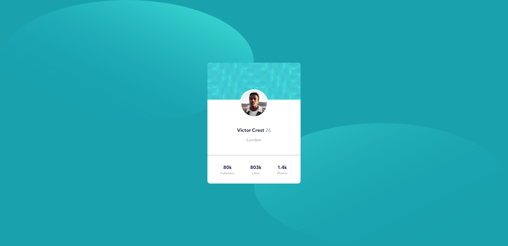
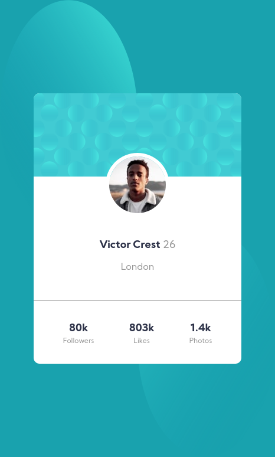

# Frontend Mentor - Profile card component solution

This is a solution to the [Profile card component challenge on Frontend Mentor](https://www.frontendmentor.io/challenges/profile-card-component-cfArpWshJ). Frontend Mentor challenges help you improve your coding skills by building realistic projects. 

## Table of contents

- [Overview](#overview)
- [The challenge](#the-challenge)
- [Screenshots](#screenshots)
    - [Computer](#computer)
    - [Mobile](#mobile)
- [Links](#links)
- [Built with](#built-with)
- [Author](#author)

## Overview

### The challenge

- Build out the project to the designs provided

### Screenshots

#### Computer

#### Mobile

### Links
- Live Site URL: [live site on Netlify](https://your-live-site-url.com)

## My process

### Built with

- Semantic HTML5 markup
- CSS custom properties
- Flexbox
- CSS Grid
- Mobile-first workflow

## Author

- Frontend Mentor - [@benwmx](https://www.frontendmentor.io/profile/benwmx)

